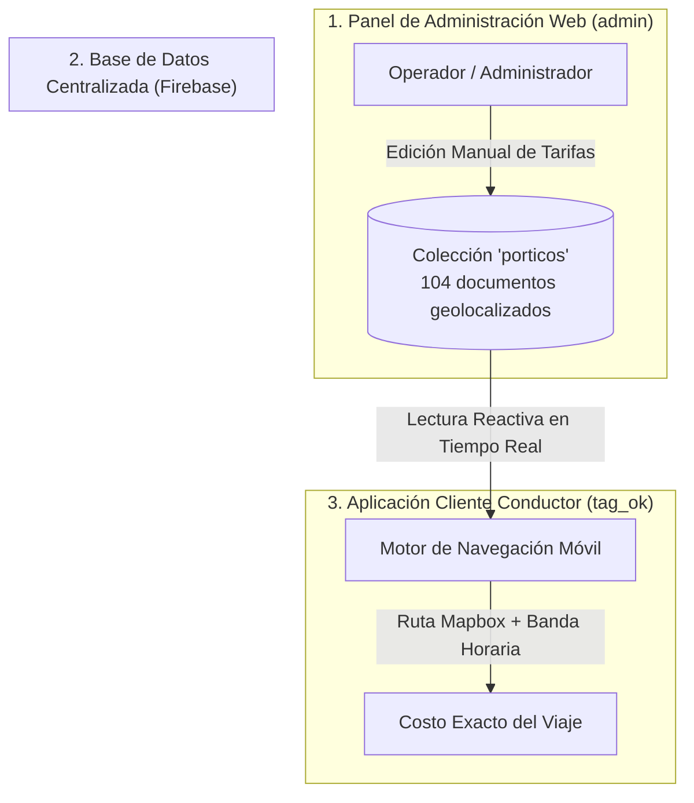

# 📊 Arquitectura de Tarifas y Sistema de Actualización en Tiempo Real - TAG OK

Este documento detalla el origen de los datos tarifarios, la arquitectura de actualización remota y la lógica matemática utilizada por la plataforma **TAG OK** para calcular el costo exacto de los peajes urbanos en tiempo real.

---

## 📌 1. Origen de los Datos Tarifarios

En Chile, las empresas concesionarias de autopistas urbanas (Autopista Central, Costanera Norte, Vespucio Sur, Vespucio Norte y AVO) **no disponen de una API pública abierta** para consultar tarifas en vivo.

Por este motivo, **TAG OK** implementa un modelo de **Información Maestra Centralizada en la Nube (Google Cloud Firestore)**:

* **Fuente de Datos Inicial**: Cuadros tarifarios oficiales publicados por las concesionarias y regulados por el Ministerio de Obras Públicas (MOP).
* **Catálogo de Pórticos**: 104 puntos de cobro georreferenciados (`lat`, `lng`) que almacenan tres categorías de cobro:
  1. `costo`: Tarifa Base / Fuera de Punta (TBFP).
  2. `costoPunta`: Tarifa Hora Punta (TBP).
  3. `costoSaturacion`: Tarifa Hora Saturación (TS).

---

## 🔄 2. Arquitectura de Sincronización y Actualización Remota

La plataforma se compone de dos componentes principales interconectados mediante la misma base de datos en tiempo real:

### A. Mantenimiento desde el Backoffice (`Producto/admin`):
* El operador del sistema administra la parametrización económica sin intervención en el código fuente.
* **Edición Individual**: Mediante el módulo de *Pórticos*, el administrador modifica valores de tarifas base, punta o saturación a través del formulario de edición.

### B. Consumo en la App Móvil (`Producto/tag_ok`):
* La app cliente **no almacena precios estáticos en el teléfono**.
* Cada vez que un conductor consulta una ruta, la aplicación lee los valores vigentes de la colección `porticos` en Firestore.
* **Ventaja**: Cuando el administrador actualiza un precio en la base de datos, **todos los conductores reciben las tarifas nuevas de inmediato sin necesidad de actualizar la aplicación en la tienda (Play Store / App Store)**.

---

## 🧮 3. Algoritmo de Cálculo Dinámico en Tiempo Real

El cálculo del costo de un viaje lo ejecuta el servicio `simulated_toll_service.dart` en tres etapas:

1. **Obtención de la Ruta**: Se consulta la API de Mapbox Directions para obtener la polilínea (coordenadas del trayecto) y la duración estimada.
2. **Detección Geométrica de Pórticos**: El algoritmo compara la polilínea contra la base de datos de pórticos. Si la ruta pasa a un radio menor o igual a **150 metros** de un pórtico, se registra la intercepción.
3. **Evaluación de Banda Horaria**: Con la hora exacta del dispositivo al momento de simular o iniciar el viaje, se aplica la tarifa correspondiente:
   * **Horario Valle / Normal**: Aplica `costo`.
   * **Horario Punta**: Aplica `costoPunta`.
   * **Horario Saturación / Alta Congestión**: Aplica `costoSaturacion`.

---

## 📄 4. Referencias en la Documentación Oficial del Proyecto

* **`Modulo_Administrador_Proyecto_TAG.docx`** *(Secciones 5.4 y 5.5)*: Define la separación entre el Front de usuario final y el Backoffice de administración de tarifas, estableciendo que el mantenimiento tarifario se realiza desde el módulo de administración.
* **`DOCUMENTACION_BASE_DE_DATOS.md`**: Detalla el esquema NoSQL de la colección `porticos` y sus atributos (`lat`, `lng`, `costo`, `costoPunta`, `costoSaturacion`).

---
*Documento técnico de arquitectura de datos - Proyecto TAG OK*
