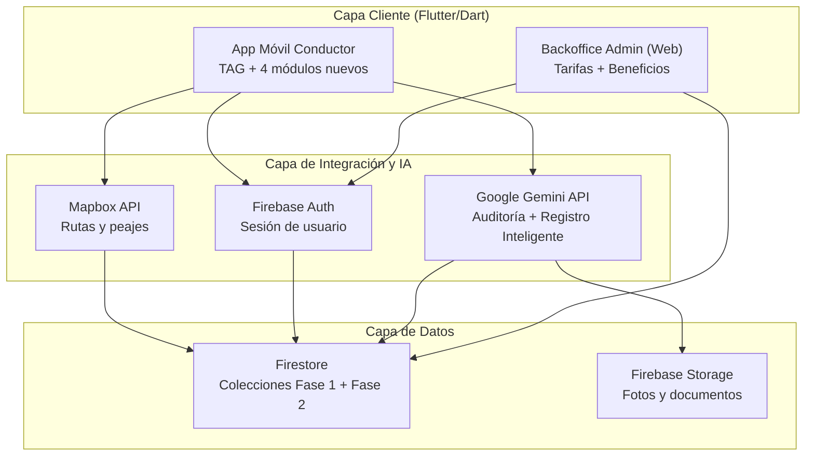

# Tag OK 🚗💨

**Tu copiloto inteligente para el control de gastos de TAG, gestión vehicular integral y auditoría con Inteligencia Artificial.**

> Optimiza tus rutas, gestiona tu presupuesto mensual, administra documentos, mantenciones, estacionamientos, combustible y beneficios de tu vehículo, y nunca más te sorprendas con cobros indebidos en tu cuenta del TAG.

[](https://flutter.dev/)
[](https://dart.dev/)
[](https://firebase.google.com/)
[](https://www.mapbox.com/)
[](https://deepmind.google/technologies/gemini/)
[](LICENSE)

---

<a id="tabla-de-contenidos" name="tabla-de-contenidos"></a>
## 📋 Tabla de Contenidos

- [Descripción](#descripcion)
- [Equipo](#equipo)
- [Metodología de Trabajo](#metodologia)
- [Arquitectura del Sistema](#arquitectura)
- [Características Principales](#caracteristicas-principales)
- [Dashboard & Visualización](#dashboard-visualizacion)
- [Auditoría Inteligente & IA](#auditoria-inteligente)
- [Panel de Administración (Admin)](#panel-admin)
- [Instalación y Ejecución Rápida](#instalacion-ejecucion)
- [Stack Tecnológico](#stack-tecnologico)
- [Estructura del Proyecto](#estructura-proyecto)

---

<a id="descripcion" name="descripcion"></a>
## 📝 Descripción

**Tag OK** es una suite completa diseñada para los conductores chilenos y las empresas operadoras. A diferencia de un GPS convencional, Tag OK integra un motor de cálculo de tarifas dinámico y permite saber el costo exacto de tu viaje en tiempo real.

Con **TAG OK 2.0 (Fase 2)**, la aplicación evoluciona de un simple controlador de gastos de peaje a un **asistente integral de gestión vehicular**: además de TAG, ahora permite administrar los documentos del vehículo, programar mantenciones, registrar estacionamientos y cargas de combustible, y acceder a un catálogo de beneficios para conductores — todo esto asistido por un componente transversal de **Inteligencia Artificial** que identifica y extrae datos automáticamente desde fotografías de documentos, boletas y tickets.

La suite también incluye un **Panel de Administración Web** para gestionar tarifas, pórticos y el nuevo catálogo de beneficios, y un motor de **Auditoría con IA (Gemini)** que analiza boletas reales (PDF/CSV) para detectar cobros fantasmas o sobreprecios.

---

<a id="equipo"></a>
## 👥 Equipo

Proyecto desarrollado para **Grupo Sentte** en el marco de la asignatura Capstone (PTY4614), Ingeniería en Informática.

| Integrante | Rol en el proyecto |
| :--- | :--- |
| **Danae Muñoz** | Líder de Proyecto — planificación general, Carta Gantt, Matriz RACI y Plan de Riesgo |
| **Almendra Cifuentes (Jazmín)** | UX/UI Designer y Aseguramiento de Calidad (QA) — requerimientos, casos de uso y criterios de aceptación |
| **Estephany Cárdenas** | Arquitecta de Software y Base de Datos — arquitectura técnica, modelo de datos e integración de IA |

---

<a id="metodologia"></a>
## 🔄 Metodología de Trabajo

El proyecto se desarrolla bajo una metodología ágil basada en **Scrum**, organizada en **5 Sprints de dos semanas** más una semana de cierre, anclada al calendario oficial de la asignatura:

| Sprint | Enfoque | Responsable |
| :--- | :--- | :--- |
| Sprint 1 | Análisis de la aplicación heredada y preparación | Almendra |
| Sprint 2 | Mi Vehículo + Registro Inteligente con IA | Estephany |
| Sprint 3 | Mantenciones | Danae |
| Sprint 4 | Estacionamientos y Combustible | Almendra |
| Sprint 5 | Beneficios + Integración + Dashboard "Mi Auto" | Estephany |

Al finalizar cada Sprint se realiza una **Sprint Review** con Grupo Sentte para validar los avances y recoger retroalimentación antes de continuar con la siguiente etapa, en lugar de esperar hasta el final del desarrollo.

---

<a id="arquitectura"></a>
## 🏗️ Arquitectura del Sistema

TAG OK 2.0 se organiza en tres capas, ampliando la arquitectura ya existente de la Fase 1 en lugar de reemplazarla:



- **Capa Cliente**: la App Móvil conserva sus funcionalidades de TAG (navegación, simulación de tarifas, alertas de presupuesto) y suma los módulos de Mi Vehículo, Mantenciones, Estacionamientos y Combustible, Beneficios, y el Dashboard "Mi Auto". El Backoffice Admin se amplía con la gestión del catálogo de beneficios.
- **Capa de Integración**: Mapbox se mantiene sin cambios respecto a la Fase 1. Google Gemini amplía su uso: además de la auditoría de boletas ya existente, ahora impulsa el componente transversal de **Registro Inteligente con IA** (captura → identifica tipo de documento → extrae datos → el usuario valida → se guarda en el módulo correspondiente).
- **Capa de Datos**: Firestore incorpora seis colecciones nuevas (`documentos_vehiculares`, `mantenciones`, `estacionamientos`, `abastecimientos`, `beneficios`, `notificaciones`) junto a las heredadas de la Fase 1 (`usuarios`, `vehiculos`, `viajes_tag`, `porticos`, `tarifas_tag`, `auditoria`). Firebase Storage se incorpora en esta capa para almacenar las imágenes de documentos y boletas capturadas por el usuario.
- El cálculo de tarifas TAG continúa apoyándose en un **motor de tarifas local** (`simulated_toll_service.dart`), 100% offline, sin depender de servicios externos de peaje.

---

<a id="caracteristicas-principales" name="caracteristicas-principales"></a>
## ✨ Características Principales

### 🛰️ Navegación en Tiempo Real
- Cálculo de rutas óptimas (Mapbox API).
- Detección satelital de pórticos en el trayecto.
- Cobros dinámicos en tiempo real según el tipo de tarifa: TBFP (Base), TBP (Punta) y TS (Saturación).
- Mantiene la sesión activa e ininterrumpida utilizando `StreamBuilder` con Firebase Auth.

### 🚗 Gestión de Flota y Presupuesto
- Identificación visual de vehículos (Autos, Motos, Camionetas) y registro de patentes.
- Semaforización de presupuesto: Alertas dinámicas al 50%, 75%, 90% y 100% de gasto mensual.

### 📄 Mi Vehículo *(nuevo — Fase 2)*
- Registro y edición de la ficha del vehículo, con foto y datos generales.
- Gestión de documentos (Permiso de Circulación, Revisión Técnica, SOAP, Seguro) con fecha de vencimiento.
- Configuración de vencimientos y visualización del estado general del vehículo.

### 🔧 Mantenciones *(nuevo — Fase 2)*
- Registro de mantenciones con costo, kilometraje y taller.
- Programación de la próxima mantención con recordatorios automáticos.
- Historial completo de mantenciones realizadas.

### 🅿️⛽ Estacionamientos y Combustible *(nuevo — Fase 2)*
- Registro manual o con cronómetro de estacionamientos.
- Registro de abastecimientos de combustible, incluyendo cargas parciales.
- Historial y visualización de gastos mensuales por categoría.

### 🎁 Beneficios *(nuevo — Fase 2)*
- Catálogo de convenios y beneficios para conductores, administrable desde el Backoffice.
- Filtro de beneficios por categoría (combustible, talleres, mantenciones, estacionamientos, seguros, accesorios).

### 🤖 Registro Inteligente con IA *(nuevo — Fase 2, transversal)*
- Captura una foto de un documento, boleta o ticket y la IA identifica el tipo, extrae los datos relevantes y precarga el formulario correspondiente.
- El usuario siempre debe **confirmar explícitamente** antes de guardar: la IA nunca almacena datos sin validación humana.
- Si la IA no reconoce algún dato, el campo queda vacío para completarlo manualmente — nunca se inventa información.

### 📊 Dashboard "Mi Auto" *(nuevo — Fase 2)*
- Vista integrada de gasto mensual, próximos vencimientos, próxima mantención, beneficios disponibles y gastos por categoría.
- Consolida en una sola pantalla la información de TAG (Fase 1) y de los nuevos módulos (Fase 2).

---

<a id="auditoria-inteligente" name="auditoria-inteligente"></a>
## 🤖 Auditoría Inteligente & IA

Olvídate de revisar boletas a mano. El sistema cruza automáticamente los datos que te cobran las autopistas versus tus viajes reales almacenados en el historial de tu GPS.
- **Motor Multi-Formato NATIVO**:
  - Lee planillas Excel (`.csv`) de Autopista Central de manera nativa.
  - Posee un analizador de texto avanzado (`PdfTextExtractor`) capaz de **leer directamente** los PDFs oficiales de Costanera Norte, Vespucio Sur y Vespucio Norte sin depender de servidores externos, de forma **100% offline y gratuita**.
- **Análisis con Gemini AI**: En su modo avanzado, procesa grandes volúmenes de datos utilizando la IA de Google Gemini para cruzar transacciones y emitir juicios claros sobre la legitimidad de las boletas.
- **Modo Contingencia**: Si la IA no está disponible, el sistema cambia instantáneamente a un motor algorítmico local ultra rápido para mostrar las discrepancias matemáticas.

---

<a id="panel-admin" name="panel-admin"></a>
## ⚙️ Panel de Administración Web (Admin)

Junto a la aplicación móvil, el repositorio incluye un **Backoffice de gestión** para operar el negocio:
- Dashboard de estadísticas generales en vivo.
- ABM (Alta/Baja/Modificación) en tiempo real de Tarifas Base, Punta y Saturación, pórticos y vehículos.
- Gestión de Usuarios (Restablecimiento de contraseñas, edición de presupuestos y eliminación).
- Gestión del catálogo de Beneficios *(nuevo — Fase 2)*.
- Se conecta en tiempo real a la misma base de datos `Firestore` que los clientes, reflejando cambios instantáneamente en las rutas.

---

<a id="instalacion-ejecucion" name="instalacion-ejecucion"></a>
## 🚀 Instalación y Ejecución Rápida (Zero Config)

Gracias a nuestro sistema de encriptación **Base64 en Memoria**, ya no necesitas configurar engorrosos archivos `.env`. Las claves (Mapbox, Firebase y Gemini) viajan protegidas y se inyectan en RAM automáticamente. ¡Solo descarga y corre!

1. **Clonar o descargar el repositorio:**
   ```bash
   git clone https://github.com/leo-onate/TAG-OK.git
   ```

2. **Ejecutar el instalador interactivo (`setup.bat`):**
   Abre la carpeta `Producto` y haz doble clic en el archivo `setup.bat`. 
   Este asistente inteligente:
   - Descargará todas las dependencias necesarias de Flutter (tanto para `tag_ok` como para `admin`).
   - Te desplegará un **Menú Interactivo**.
   - Te permitirá elegir qué aplicación quieres encender (App Móvil o Backoffice Admin) y en qué plataforma (Windows Desktop o Chrome).
   
   ¡Simplemente escribe un número del 1 al 5 y la magia sucederá sola!

---

<a id="stack-tecnologico" name="stack-tecnologico"></a>
## 🛠️ Stack Tecnológico

| Componente | Tecnología |
| :--- | :--- |
| **Framework Base** | Flutter (Multiplataforma) |
| **Base de Datos** | Firebase Cloud Firestore |
| **Almacenamiento de Archivos** | Firebase Storage *(nuevo — Fase 2, fotos de documentos y boletas)* |
| **Autenticación** | Firebase Auth (Persistencia Nativa) |
| **Mapas** | Flutter Map + Mapbox API |
| **Cálculo de Tarifas TAG** | Motor de tarifas local (`simulated_toll_service.dart`), 100% offline |
| **Inteligencia Artificial**| Google Gemini API (`google_generative_ai`) — auditoría de boletas y Registro Inteligente con IA |
| **Procesamiento de Archivos**| `file_picker`, `syncfusion_flutter_pdf`, `csv` |

---

<a id="estructura-proyecto" name="estructura-proyecto"></a>
## 📂 Estructura del Repositorio

```bash
TAG-OK/
├── Producto/
│   ├── setup.bat         # 🚀 ASISTENTE DE EJECUCIÓN (Ejecutar este archivo)
│   ├── tag_ok/           # Código fuente de la Aplicación Móvil
│   ├── admin/            # Código fuente del Panel de Administración
│   └── Base de datos/    # Modelo Relacional, Documentación del proyecto
└── FASE 1/        # Individuales, Grupales
```

---
*Desarrollado con ❤️ para transformar las autopistas concesionadas en Chile.*
a